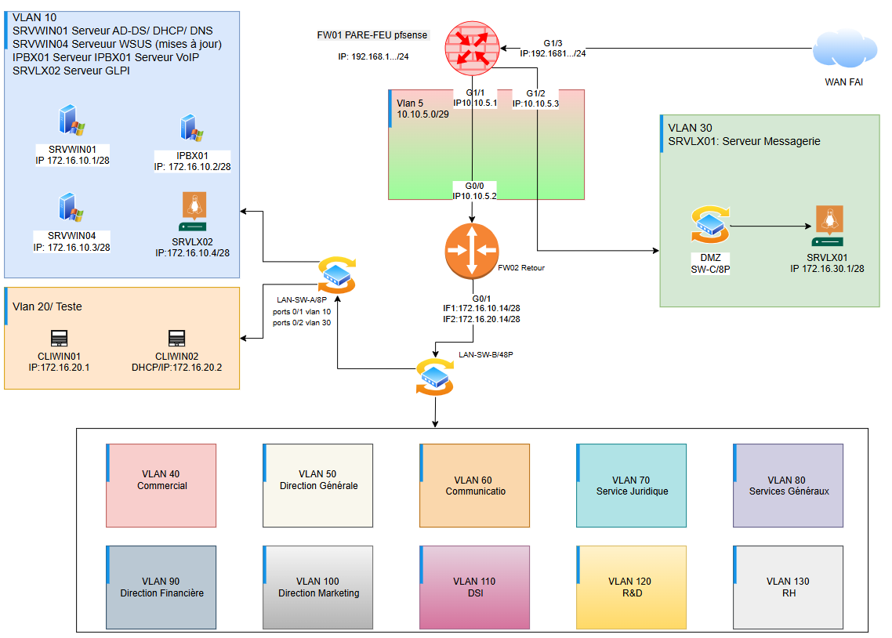

---
## Prjoet TSSR-1025-P3-G7 Mise en place de Infrastructure Réseau pour Ekoloclast

## À Propos:  
Projet de mise en place d'une infrastructure réseau professionnelle complète pour Ekoloclast, une start-up spécialisée dans l'écologie.    
183 employés répartis dans 10 départements, en pleine croissance Fusion/acquisition prévue prochainement 

Situation actuelle:  
Réseau wifi non sécurisé  
PC en workgroup sans authentification  
Aucune gestion centralisée  
Stockage local uniquement  

Objectif : Remplacer le réseau actuel basique (box FAI + wifi) par une infrastructure d'entreprise sécurisée et centralisée.

Situation cible:    
Infrastructure segmentée (WAN/LAN/DMZ)  
Domaine Active Directory  
Services centralisés (DNS, DHCP, messagerie, VoIP, GLPI, WSUS)  
Sécurité renforcée avec pare-feu  

Architecture prévue  
Serveurs:  
FW01 : Pare-feu pfSense (WAN/LAN/DMZ)  
SRVWIN01 : Windows Server 2022 (AD-DS, DNS, DHCP)  
SRVWIN04 : Windows Server 2022 (WSUS mises à jour Windows)  
SRVLX01 : (Messagerie Zimbra ou iRedMail)
SRVLX02:  GLPI (gestion de parc + ticketing) 
IPBX01 : FreePBX (VoIP)  
CLIWIN01/02 : Clients Windows 10/11  
Avancement  
Tache 1 : Phase de planification

Tableau d'inventaire matériel  
Schéma réseau complet  
Plan d'adressage IP  
Nomenclature des noms  

⚠️ Note importante: le périmètre du Ce projet se concentre sur 4 VLANs VLANS5,10, 20, et 30 sur les 13 prévus dans l'architecture complète :
Raison de cette limitation Des ressources matérielles importantes que n'est pas rialisable sur VirtualBox.

---
Plan d'adressage IP complet:

| VLAN / Zone | Réseau | IP | Équipement | Masque | Gateway | DNS | Utilisation / Remarques |
|------------|--------|----|------------|--------|---------|-----|--------------------------|
| VLAN 5 Gestion | 10.10.5.0/29 | 10.10.5.0 | - | /29 | - | - | Adresse réseau |
| VLAN 5 Gestion | 10.10.5.0/29 | 10.10.5.1 | FW01 | /29 | - | - | Interface gestion FW01 |
| VLAN 5 Gestion | 10.10.5.0/29 | 10.10.5.2 | FW02 | /29 | 10.10.5.1 | - | Interface WAN FW02 |
| VLAN 5 Gestion | 10.10.5.0/29 | 10.10.5.3 | FW01 | /29 | - | - | Interconnexion FW01→FW02 |
| VLAN 5 Gestion | 10.10.5.0/29 | 10.10.5.7 | - | /29 | - | - | Broadcast |
| VLAN 10 Serveurs | 172.16.10.0/28 | 172.16.10.0 | - | /28 | - | - | Adresse réseau |
| VLAN 10 Serveurs | 172.16.10.0/28 | 172.16.10.1 | SRVWIN01 | /28 | 172.16.10.14 | 127.0.0.1 | AD / DNS / DHCP |
| VLAN 10 Serveurs | 172.16.10.0/28 | 172.16.10.2 | IPBX01 | /28 | 172.16.10.14 | 172.16.10.1 | VoIP FreePBX |
| VLAN 10 Serveurs | 172.16.10.0/28 | 172.16.10.3 | SRVWIN04 | /28 | 172.16.10.14 | 172.16.10.1 | WSUS |
| VLAN 10 Serveurs | 172.16.10.0/28 | 172.16.10.4 | SRVLX02 | /28 | 172.16.10.14 | 172.16.10.1 | GLPI |
| VLAN 10 Serveurs | 172.16.10.0/28 | 172.16.10.14 | FW02 | /28 | - | - | Gateway VLAN 10 |
| VLAN 10 Serveurs | 172.16.10.0/28 | 172.16.10.15 | - | /28 | - | - | Broadcast |
| VLAN 20 Clients | 172.16.20.0/28 | 172.16.20.0 | - | /28 | - | - | Adresse réseau |
| VLAN 20 Clients | 172.16.20.0/28 | 172.16.20.1 | CLIWIN01 | /28 | 172.16.20.14 | 172.16.10.1 | Client DHCP |
| VLAN 20 Clients | 172.16.20.0/28 | 172.16.20.2 | CLIWIN02 | /28 | 172.16.20.14 | 172.16.10.1 | Client DHCP |
| VLAN 20 Clients | 172.16.20.0/28 | 172.16.20.14 | FW02 | /28 | - | - | Gateway VLAN 20 |
| VLAN 20 Clients | 172.16.20.0/28 | 172.16.20.15 | - | /28 | - | - | Broadcast |
| VLAN 30 DMZ | 172.16.30.0/28 | 172.16.30.0 | - | /28 | - | - | Adresse réseau |
| VLAN 30 DMZ | 172.16.30.0/28 | 172.16.30.1 | SRVLX01 | /28 | 172.16.30.14 | 172.16.10.1 | Messagerie iRedMail |
| VLAN 30 DMZ | 172.16.30.0/28 | 172.16.30.14 | FW01 | /28 | - | - | Gateway DMZ |
| VLAN 30 DMZ | 172.16.30.0/28 | 172.16.30.15 | - | /28 | - | - | Broadcast |
| FAI Internet | 192.168.1.0 | 192.168.1... | FW01 | /24 | 192.168.1.1 | 192.168.1.1 | Connexion Internet |

Tache suivantes : Installation et configuration
