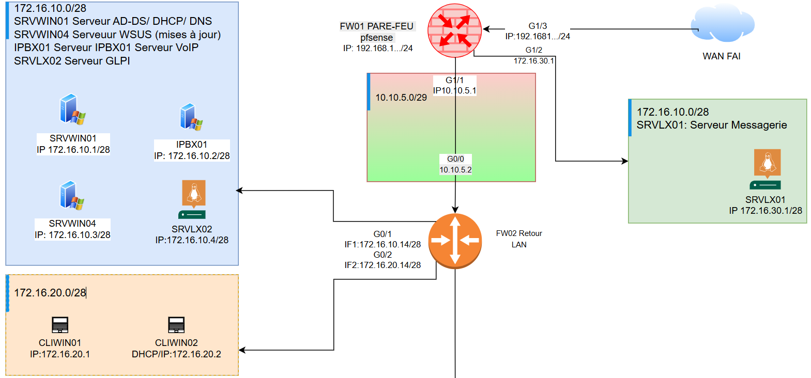

# Projet TSSR-1025-P3-G7 — Infrastructure Réseau Ekoloclast

---

## Sommaire

1. [À propos](#à-propos)
2. [Situation actuelle](#situation-actuelle)
3. [Situation cible](#situation-cible)
4. [Architecture prévue](#architecture-prévue)
5. [Inventaire des machines](#inventaire-des-machines)
6. [Réseaux](#réseaux)
7. [Services et Ports](#services-et-ports)
8. [Identifiants](#identifiants)
9. [Accès Web](#accès-web)
10. [Extensions VoIP](#extensions-voip)
11. [Enregistrements DNS](#enregistrements-dns)
12. [Configuration VirtualBox](#configuration-virtualbox)
13. [Documentation](#documentation)

---

## À propos

Projet réalisé dans le cadre de la formation TSSR — mise en place d'une infrastructure réseau professionnelle complète pour **Ekoloclast**, une start-up parisienne spécialisée dans l'écologie.

- **183 employés** répartis dans 10 départements
- Start-up en pleine croissance
- Fusion/acquisition prévue prochainement

**Objectif :** Remplacer le réseau actuel basique (box FAI + wifi) par une infrastructure d'entreprise sécurisée et centralisée.

---

## Situation actuelle

- Réseau wifi non sécurisé
- PC en workgroup sans authentification
- Aucune gestion centralisée
- Stockage local uniquement

---

## Situation cible

- Infrastructure segmentée (WAN/LAN/DMZ)
- Domaine Active Directory
- Services centralisés (DNS, DHCP, messagerie, VoIP)
- Sécurité renforcée avec pare-feu
### Schéma réseau Ekoloclast

---

## Architecture prévue

| Nom | Rôle |
|-----|------|
| FW01 | Pare-feu pfSense (WAN / Transit / DMZ) |
| FW02 | Routeur LAN (Debian 12) |
| SRVWIN01 | Windows Server 2022 (AD-DS, DNS, DHCP) |
| SRVWIN04 | Windows Server 2022 Core (WSUS) |
| SRVLX01 | Debian 12 — Messagerie iRedMail |
| SRVLX02 | Ubuntu Server 22.04 — GLPI (Docker) |
| IPBX01 | FreePBX (VoIP) |
| CLIWIN01/02 | Clients Windows 10/11 |

---

## Inventaire des machines

### Pare-feu et Routeurs

| Nom | OS | Rôle | Interface | IP | Masque |
|-----|-----|------|-----------|-----|--------|
| FW01 | pfSense | Pare-feu principal | WAN | DHCP | - |
| | | | Transit | 10.10.5.1 | /29 |
| | | | DMZ | 172.16.30.1 | /28 |
| FW02 | Debian 12 | Routeur inter-VLAN | Transit | 10.10.5.2 | /29 |
| | | | LAN_SRV | 172.16.10.1 | /28 |
| | | | LAN_TEST | 172.16.20.1 | /28 |

### Serveurs

| Nom | OS | Rôle | IP | Passerelle | DNS | Zone |
|-----|-----|------|-----|------------|-----|------|
| SRVWIN01 | Windows Server 2022 GUI | AD / DNS / DHCP | 172.16.10.2/28 | 172.16.10.1 | 127.0.0.1 | LAN_SRV |
| SRVLX02 | Ubuntu Server 22.04 | GLPI (Docker) | 172.16.10.3/28 | 172.16.10.1 | 172.16.10.2 | LAN_SRV |
| SRVWIN04 | Windows Server 2022 Core | WSUS | 172.16.10.4/28 | 172.16.10.1 | 172.16.10.2 | LAN_SRV |
| IPBX01 | FreePBX 16 (CentOS) | VoIP / Téléphonie | 172.16.10.5/28 | 172.16.10.1 | 172.16.10.2 | LAN_SRV |
| SRVLX01 | Debian 12 | Messagerie iRedMail | 172.16.30.2/28 | 172.16.30.1 | 172.16.10.2 | DMZ |

### Clients

| Nom | OS | Rôle | IP | Passerelle | DNS | Zone |
|-----|-----|------|-----|------------|-----|------|
| CLIWIN01 | Windows 10 | Poste client | DHCP | 172.16.20.1 | 172.16.10.2 | LAN_TEST |
| CLIWIN02 | Windows 10 | Poste client | DHCP | 172.16.20.1 | 172.16.10.2 | LAN_TEST |

---

## Réseaux

| Nom | Plage | Masque | Passerelle | Description |
|-----|-------|--------|------------|-------------|
| Transit | 10.10.5.0/29 | 255.255.255.248 | 10.10.5.1 | Liaison FW01 ↔ FW02 |
| LAN_SRV | 172.16.10.0/28 | 255.255.255.240 | 172.16.10.1 | Serveurs internes |
| LAN_TEST | 172.16.20.0/28 | 255.255.255.240 | 172.16.20.1 | Postes clients |
| DMZ | 172.16.30.0/28 | 255.255.255.240 | 172.16.30.1 | Zone démilitarisée |

---

## Services et Ports

| Service | Serveur | Port | Description |
|---------|---------|------|-------------|
| DNS | SRVWIN01 | 53 | Résolution de noms |
| DHCP | SRVWIN01 | 67-68 | Attribution IP |
| LDAP | SRVWIN01 | 389 | Active Directory |
| WSUS | SRVWIN04 | 8530 | Mises à jour Windows |
| GLPI | SRVLX02 | 80 | Gestion de parc / Ticketing |
| SMTP | SRVLX01 | 25, 587 | Messagerie sortante |
| IMAP | SRVLX01 | 993 | Messagerie entrante |
| SIP | IPBX01 | 5060 | VoIP signalisation |
| RTP | IPBX01 | 10000-20000 | VoIP audio |

---

## Identifiants

| Machine | Utilisateur | Mot de passe |
|---------|-------------|--------------|
| SRVWIN01 | tssr\Administrator | Azerty1* |
| SRVWIN04 | tssr\Administrator | Azerty1* |
| SRVLX01 | root | Azerty1* |
| SRVLX02 | safi | Azerty1* |
| IPBX01 | root | Azerty1* |
| FW01 | admin | pfsense |
| FW02 | admin | Azerty1* |

---

## Accès Web

| Service | URL | Utilisateur | Mot de passe |
|---------|-----|-------------|--------------|
| pfSense | https://10.10.5.1 | admin | pfsense |
| GLPI | http://172.16.10.3 | glpi | glpi |
| FreePBX | http://172.16.10.5 | admin | Azerty1* |
| iRedAdmin | https://172.16.30.2/iredadmin | postmaster@tssr.lan | Azerty1* |
| Webmail | https://172.16.30.2/mail | user@tssr.lan | - |

---

## Extensions VoIP

| Extension | Nom | Secret | Poste |
|-----------|-----|--------|-------|
| 20001 | Safi WILDER | 1234 | CLIWIN01 |
| 20002 | Admin IT | 1234 | CLIWIN01 |
| 20003 | Support | 1234 | CLIWIN02 |
| 20004 | Direction | 1234 | CLIWIN02 |

---

## Enregistrements DNS

| Type | Nom | Valeur |
|------|-----|--------|
| A | srvwin01 | 172.16.10.2 |
| A | srvlx02 | 172.16.10.3 |
| A | srvwin04 | 172.16.10.4 |
| A | ipbx01 | 172.16.10.5 |
| A | mail | 172.16.30.2 |
| MX | @ | mail.tssr.lan (priorité 10) |

---

## Configuration VirtualBox

| Machine | Type | RAM | Disque | Réseau |
|---------|------|-----|--------|--------|
| FW01 | BSD | 1024 MB | 10 GB | NAT + Transit + DMZ |
| FW02 | Debian | 512 MB | 10 GB | Transit + LAN_SRV + LAN_TEST |
| SRVWIN01 | Windows | 4096 MB | 50 GB | LAN_SRV |
| SRVLX02 | Ubuntu | 2048 MB | 20 GB | LAN_SRV |
| SRVWIN04 | Windows | 2048 MB | 60 GB | LAN_SRV |
| IPBX01 | Linux | 1024 MB | 20 GB | LAN_SRV |
| SRVLX01 | Debian | 4096 MB | 40 GB | DMZ |
| CLIWIN01 | Windows | 2048 MB | 50 GB | LAN_TEST |
| CLIWIN02 | Windows | 2048 MB | 50 GB | LAN_TEST |

---

## Documentation

| Machine | Installation | Guide utilisateur |
|---------|--------------|-------------------|
| FW01 / FW02 | [Install.md](https://github.com/WildCodeSchool/TSSR-1025-P3-G7/blob/main/Firewall/Install.md) | [User_Guide.md](https://github.com/WildCodeSchool/TSSR-1025-P3-G7/blob/main/Firewall/User_Guide.md) |
| SRVWIN01 | [Install.md](https://github.com/WildCodeSchool/TSSR-1025-P3-G7/blob/main/AD_DS%20Domain/Install.md) | [User_Guide.md](https://github.com/WildCodeSchool/TSSR-1025-P3-G7/blob/main/AD_DS%20Domain/User_Guide.md) |
| SRVLX02 | [Install.md](https://github.com/WildCodeSchool/TSSR-1025-P3-G7/blob/main/GLPI/Install.md) | [User_Guide.md](https://github.com/WildCodeSchool/TSSR-1025-P3-G7/blob/main/GLPI/User_Guide.md) |
| SRVWIN04 | [Install.md](https://github.com/WildCodeSchool/TSSR-1025-P3-G7/blob/main/WSUS/Install.md) | [User_Guide.md](https://github.com/WildCodeSchool/TSSR-1025-P3-G7/blob/main/WSUS/User_Guide.md) |
| IPBX01 | [Install.md](https://github.com/WildCodeSchool/TSSR-1025-P3-G7/blob/main/Voip/Install.md) | [User_Guide.md](https://github.com/WildCodeSchool/TSSR-1025-P3-G7/blob/main/Voip/User_Guide.md) |
| SRVLX01 | [Install.md](https://github.com/WildCodeSchool/TSSR-1025-P3-G7/blob/main/Messagerie/Install.md) | [User_Guide.md](https://github.com/WildCodeSchool/TSSR-1025-P3-G7/blob/main/Messagerie/User_Guide.md) |
| CLIWIN01 / CLIWIN02 | [Install.md](https://github.com/WildCodeSchool/TSSR-1025-P3-G7/blob/main/Clients/Install.md) | [User_Guide.md](https://github.com/WildCodeSchool/TSSR-1025-P3-G7/blob/main/Clients/User_Guide.md) |

---

**Auteur :** Safiullah   
**Projet :** Ekoloclast   
**Formation :** TSSR Simplon by Wild Code School  
